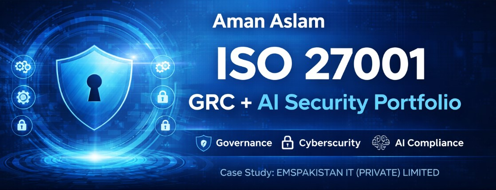

# Aman Aslam

## ISO 27001 GRC + AI Security Portfolio

---

## 📌 About This Portfolio

This repository presents a complete **ISO/IEC 27001:2022 Information Security Management System (ISMS)** implementation, combined with **AI Security Governance and GRC practices**.

This is a **real-world practical portfolio** developed to demonstrate hands-on expertise in:

* Governance, Risk & Compliance (GRC)
* ISO 27001 Implementation
* AI Security & Risk Management
* Internal Audit & Management Review

---

## 🏢 Case Study Organization

**EMSPAKISTAN IT (PRIVATE) LIMITED**

* SECP Registered ✔️
* PSEB Registered ✔️
* Chamber of Commerce Member ✔️
* UNGM Official Supplier ✔️

This portfolio simulates a **complete ISMS implementation** for a globally operating IT company.

---

## 📂 Portfolio Structure

```
ISO27001-GRC-Portfolio/
│
├── Company_Overview.pdf
├── ISMS_Scope_and_Context.pdf
├── Risk_Methodology.pdf
├── Risk_Assessment.xlsx
├── Risk_Treatment_Plan.pdf
├── Statement_of_Applicability.xlsx
│
├── Policies/
│   ├── Information_Security_Policy.pdf
│   ├── Access_Control_Policy.pdf
│   ├── Password_Policy.pdf
│   ├── AI_Security_Policy.pdf
│
├── Internal_Audit_Report.pdf
├── Management_Review_Report.pdf
```

---

## 🔍 Key Highlights

* Full ISO/IEC 27001:2022 aligned ISMS
* Practical Risk Assessment & Treatment Plan
* Complete Statement of Applicability (SoA)
* AI Security Policy (advanced + rare skill)
* Internal Audit Simulation
* Management Review Report

---

## 🎯 Purpose

This portfolio is designed for:

* GRC Analyst (AI + Security) roles
* Cybersecurity / Compliance positions
* Freelance consulting & client acquisition

It demonstrates **practical implementation skills**, not just theoretical knowledge.

---

## 📈 How to Use

* Review policies to understand control implementation
* Analyze Risk Assessment & SoA for decision-making
* Check Audit & Management Review for governance insight
* Use as a reference for ISO 27001 implementation projects

---

## 📬 Contact

**Aman Aslam**
amanaslam2015@gmail.com
https://www.linkedin.com/in/amanaslam2015/
